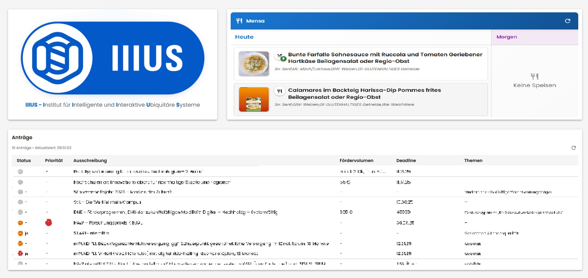

# IIIUS Foyer Dashboard

A modern web dashboard application designed for display in foyer environments, featuring real-time data integration and a responsive grid-based layout. Built with Laravel backend and React frontend.

  


## 🚀 Features

### 📊 Dashboard Components
- **Modular Grid Layout**: 16x9 responsive grid system for flexible component arrangement
- **Real-time Data Updates**: Automatic refresh intervals for live data display
- **Material-UI Design**: Clean, modern interface with consistent theming

### 🍽️ Mensa Integration
- **Daily Menu Display**: Fetches and displays current mensa (cafeteria) menus
- **Image Integration**: Automatic meal image fetching via Google Images API
- **Multi-day View**: Shows menus for upcoming days
- **Price Information**: Complete pricing details for students, employees, and guests
- **Allergen Information**: Detailed allergen and nutritional information

### 📋 Proposal Management
- **Document Processing**: Supports CSV, XML, and Excel file formats
- **Nextcloud Integration**: Direct file access from Nextcloud storage
- **Status Tracking**: Real-time proposal status updates
- **Automated Parsing**: Intelligent document parsing with multiple format support

### 🔧 Technical Features
- **RESTful API**: Clean API endpoints for all data operations
- **Service Architecture**: Modular service classes for external integrations
- **Error Handling**: Comprehensive error logging and user feedback
- **Health Monitoring**: Built-in health check endpoints
- **Cross-platform**: Works on Windows, macOS, and Linux

## 🛠️ Tech Stack

### Backend
- **Framework**: Laravel 11.x
- **PHP**: 8.2+
- **Database**: SQLite (configurable to MySQL/PostgreSQL)
- **File Processing**: League CSV, PhpSpreadsheet
- **HTTP Client**: Guzzle HTTP

### Frontend
- **Framework**: React 19.x
- **UI Library**: Material-UI (MUI) 7.x
- **Typography**: Poppins font family
- **Build Tool**: Create React App

### External Integrations
- **Nextcloud**: WebDAV file access
- **Google Images API**: Meal image retrieval
- **Mensa API**: Menu data integration

## 📦 Installation

### Prerequisites
- **PHP** 8.2 or higher
- **Node.js** 18 or higher
- **Composer** (PHP package manager)
- **npm** or **yarn** (Node package manager)

### Backend Setup

1. **Clone the repository**
   ```bash
   git clone https://github.com/EdBinder/dashboard.git
   cd dashboard
   ```

2. **Navigate to backend directory**
   ```bash
   cd backend
   ```

3. **Install PHP dependencies**
   ```bash
   composer install
   ```

4. **Environment configuration**
   ```bash
   cp .env.example .env
   ```
   
   **Configure your `.env` file with:**
   ```env
   # Application
   APP_NAME="IIIUS Dashboard"
   APP_URL=http://localhost:8000
   
   # Database (SQLite by default)
   DB_CONNECTION=sqlite
   
   # Nextcloud Integration
   NEXTCLOUD_URL=https://your-nextcloud-server.com
   NEXTCLOUD_USERNAME=your-username
   NEXTCLOUD_PASSWORD=your-password
   NEXTCLOUD_FILE_PATH=/Documents/proposals.csv
   
   # Mensa API
   MENSA_API_URL=https://your-mensa-api.com
   API_KEY=your-mensa-api-key
   ORT_ID=your-location-id
   
   # Google Images (Optional)
   GOOGLE_IMAGES_API_KEY=your-google-api-key
   GOOGLE_CSE_ID=your-custom-search-engine-id
   ```

5. **Generate application key**
   ```bash
   php artisan key:generate
   ```

6. **Create database and run migrations**
   ```bash
   touch database/database.sqlite
   php artisan migrate
   ```

7. **Start the backend server**
   ```bash
   php artisan serve
   ```
   The API will be available at `http://localhost:8000`

### Frontend Setup

1. **Navigate to frontend directory**
   ```bash
   cd ../frontend
   ```

2. **Install Node dependencies**
   ```bash
   npm install
   ```

3. **Environment configuration**
   ```bash
   cp .env.example .env
   ```
   
   **Configure your `.env` file:**
   ```env
   REACT_APP_API_URL=http://localhost:8000/api
   ```

4. **Start the development server**
   ```bash
   npm start
   ```
   The frontend will be available at `http://localhost:3000`

## 🚀 Usage

### Dashboard Layout Configuration

The dashboard uses a flexible 16x9 grid system. Configure modules in `frontend/src/App.js`:

```javascript
const layoutConfig = [
  { 
    id: 'mensa', 
    x: 0, y: 4, w: 8, h: 5, 
    title: 'Mensa Menu', 
    component: <Mensa /> 
  },
  { 
    id: 'proposals', 
    x: 8, y: 4, w: 8, h: 5, 
    title: 'Current Proposals', 
    component: <Antraege /> 
  }
];
```

### API Endpoints

- `GET /api/health` - Service health check
- `GET /api/mensa` - Current mensa menu data
- `GET /api/proposals` - Proposal/application data
- `GET /api/parser/health` - File parser service status

### Adding New Components

1. **Create component** in `frontend/src/components/`
2. **Add to layout** in `App.js`
3. **Configure grid position** (x, y, w, h)
4. **Import and register** the component

## 🔧 Configuration

### Mensa Integration
Configure mensa API settings in backend `.env`:
```env
MENSA_API_URL=https://api.studentenwerk.de
API_KEY=your-api-key
ORT_ID=location-identifier
```

### Nextcloud Integration
Set up Nextcloud access in backend `.env`:
```env
NEXTCLOUD_URL=https://cloud.example.com
NEXTCLOUD_USERNAME=dashboard-user
NEXTCLOUD_PASSWORD=secure-password
NEXTCLOUD_FILE_PATH=/Shared/proposals.csv
```

### Auto-refresh Settings
Configure refresh intervals in frontend components:
```javascript
const REFRESH_INTERVAL = 120000; // 2 minutes
```

## 🧪 Development

### Backend Development
```bash
cd backend

# Run tests
php artisan test

# Code formatting
./vendor/bin/pint

# Start with hot reload
php artisan serve --host=0.0.0.0 --port=8000
```

### Frontend Development
```bash
cd frontend

# Run tests
npm test

# Build for production
npm run build

# Analyze bundle size
npm run build -- --analyze
```

### Adding New Services

1. **Create service class** in `backend/app/Services/`
2. **Register in controller** or use dependency injection
3. **Add corresponding API routes** in `routes/api.php`
4. **Update frontend components** to consume new endpoints

## 📁 Project Structure

```
dashboard/
├── backend/                 # Laravel API backend
│   ├── app/
│   │   ├── Http/Controllers/    # API controllers
│   │   ├── Services/           # Business logic services
│   │   └── Models/             # Eloquent models
│   ├── routes/api.php          # API routes definition
│   ├── config/                 # Laravel configuration
│   └── database/               # Migrations and seeders
│
├── frontend/                # React frontend
│   ├── src/
│   │   ├── components/         # React components
│   │   │   ├── Mensa.js       # Mensa menu component
│   │   │   ├── Antraege.js    # Proposals component
│   │   │   ├── GridLayout.js  # Grid layout system
│   │   │   └── ModuleSlot.js  # Individual module container
│   │   ├── App.js             # Main application component
│   │   └── index.js           # Application entry point
│   └── public/                 # Static assets and logos
│
└── README.md                # This file
```

## 🤝 Contributing

1. **Fork the repository**
2. **Create feature branch** (`git checkout -b feature/amazing-feature`)
3. **Commit changes** (`git commit -m 'Add amazing feature'`)
4. **Push to branch** (`git push origin feature/amazing-feature`)
5. **Open Pull Request**

## 📄 License

This project is licensed under the MIT License. See the [LICENSE](LICENSE) file for details.

## 📞 Support

For support and questions:
- **Issues**: [GitHub Issues](https://github.com/EdBinder/dashboard/issues)
- **Email**: Contact the development team
- **Documentation**: Check the inline code documentation

## 🎯 Roadmap

- [ ] User authentication and role management
- [ ] Additional dashboard modules (weather, news, etc.)
- [ ] Mobile-responsive design improvements
- [ ] Real-time notifications system
- [ ] Advanced caching mechanisms
- [ ] Multi-language support
- [ ] Custom theming options

---

**Built with ❤️ for IIIUS**
